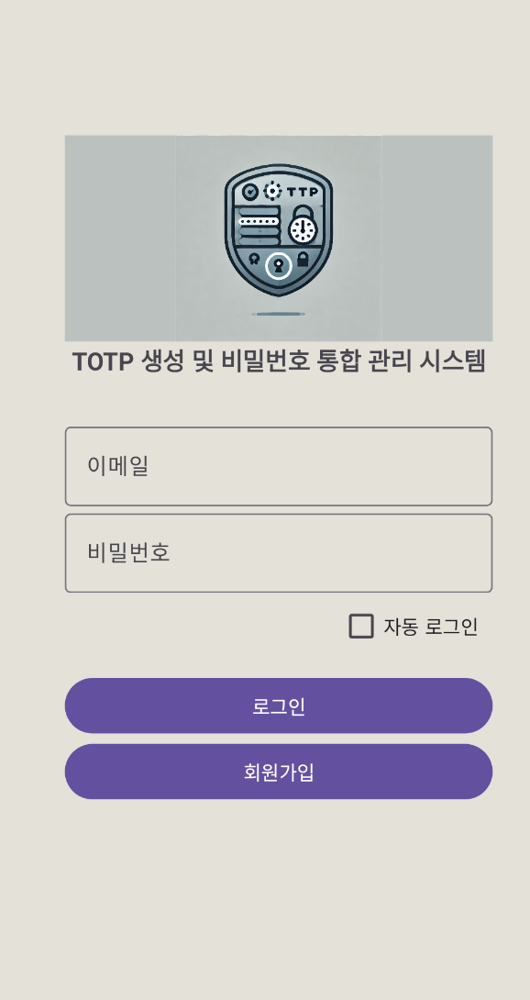
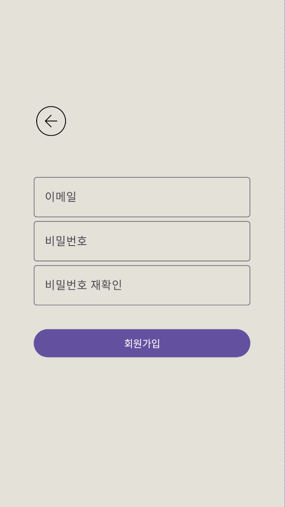

## 1. 로그인/회원가입

  
  
  
  <figcaption align="center">왼쪽부터 스플래시 화면, 로그인 화면, 회원가입 화면</figcaption>

## 2. 로그인 후 메인 화면

  " align="center" width="32%">
  " align="center" width="32%">
  " align="center" width="32%">
  <figcaption align="center">왼쪽부터 tab1(=목표설정탭), tab2(=홈화면), tab3(=설정탭)</figcaption>

  